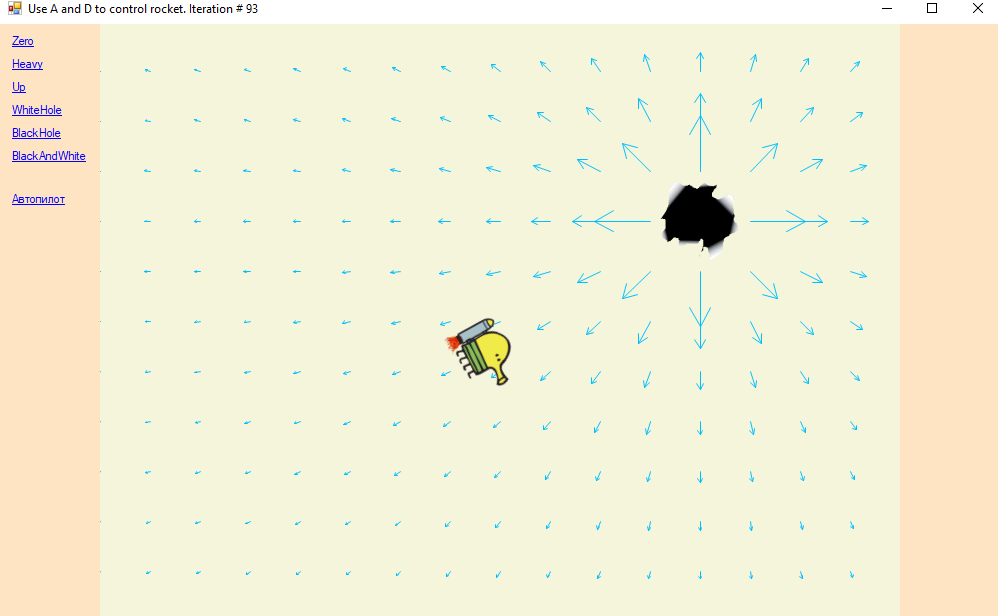

# RocketGame

Это учебный проект, который представляет собой игру на C# с использованием WinForms. Игрок управляет каракулей и должен попасть в дыру, при этом в различных уровнях имеются различные настройки гравитации, что усложняет задачу. Управление осуществляется клавишами A/D, отвечающими за наклон влево/вправо соответственно. Переключение уровней осуществляется нажатием на соответствующие надписи в левом углу программы. В качестве бонуса там же имеется возможность включить режим автопилота, в котором каракуля будет сама пытаться долететь до цели. Игра написана исключительно в целях обучения и получения удовольствия во время ее написания.

# Установка

- Установите на компьютер Visual Studio (версия 2017 или выше) и .NET Framework (версия 4.5 или выше), если они еще не установлены.
- Склонируйте репозиторий с помощью Git или загрузите архив с исходным кодом проекта.
- Скомпилируйте проект и запустите игру

# Скриншоты

Если возникнут какие-либо вопросы не стесняйтесь писать :)
